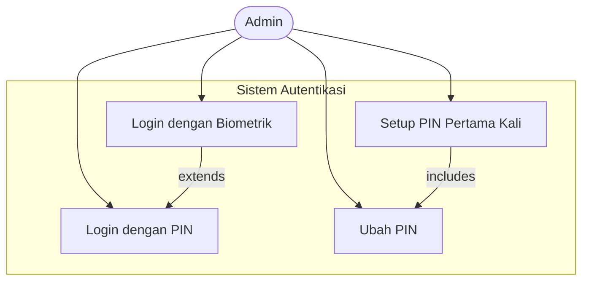
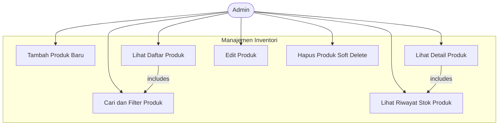
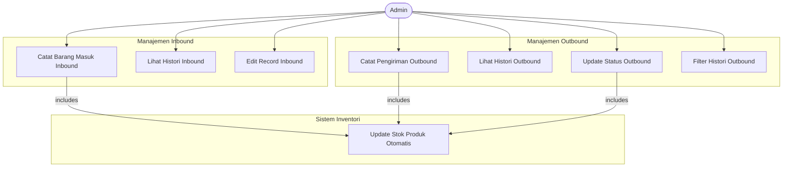
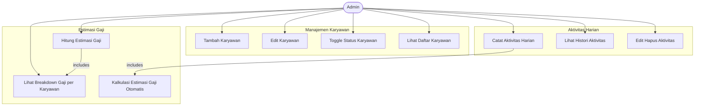
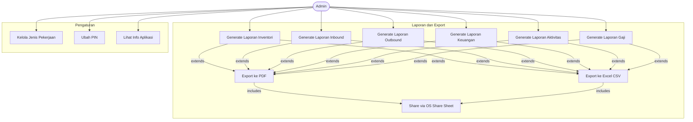
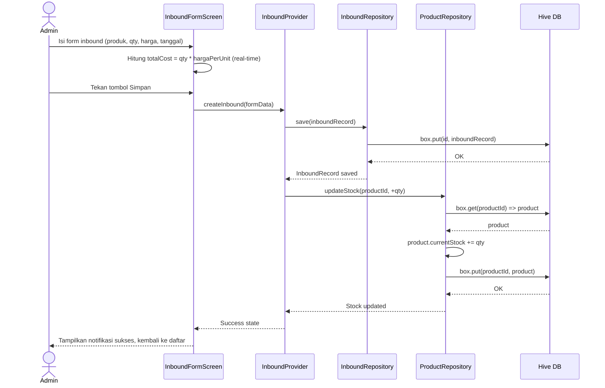
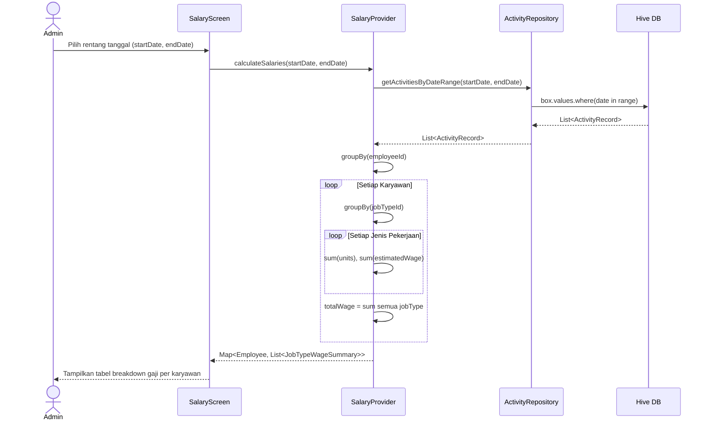

# SRS — Software Requirements Specification
# Aplikasi: **Gudangs**
**Versi Dokumen:** 1.0.0  
**Tanggal:** 2 Juli 2026  
**Status:** Draft untuk Review  
**Standar Referensi:** IEEE 830-1998  
**Penulis:** Tim Engineering  

---

## Daftar Isi

1. [Introduction](#1-introduction)
2. [Overall Description](#2-overall-description)
3. [Specific Requirements](#3-specific-requirements)
   - 3.1 [Functional Requirements](#31-functional-requirements)
   - 3.2 [Non-Functional Requirements](#32-non-functional-requirements)
4. [Data Models](#4-data-models)
5. [System Architecture](#5-system-architecture)
6. [External Interface Requirements](#6-external-interface-requirements)
7. [Use Case Diagrams](#7-use-case-diagrams)

---

## 1. Introduction

### 1.1 Purpose

Dokumen ini merupakan Software Requirements Specification (SRS) untuk aplikasi **Gudangs**. Dokumen ini mendeskripsikan fungsionalitas, batasan, dan persyaratan non-fungsional yang harus dipenuhi oleh sistem secara lengkap dan terukur.

Dokumen ini ditujukan kepada:
- **Tim pengembang (Developer):** sebagai panduan teknis implementasi.
- **Tim QA/Testing:** sebagai acuan skenario pengujian.
- **Product Owner / Stakeholder:** untuk validasi dan persetujuan ruang lingkup.

### 1.2 Scope

**Nama Sistem:** Gudangs  
**Platform:** Mobile (Android & iOS) — dikembangkan menggunakan Flutter  
**Mode Operasional:** Offline-first (tanpa koneksi internet wajib)

Gudangs adalah aplikasi manajemen gudang mandiri untuk usaha kecil dan menengah. Sistem ini mencakup:

- Autentikasi biometrik dan PIN
- Dashboard statistik operasional
- Manajemen inventori (produk & stok)
- Pencatatan barang masuk (inbound) dan barang keluar (outbound)
- Manajemen karyawan dan aktivitas harian
- Kalkulasi estimasi gaji karyawan
- Pelaporan dan ekspor dokumen (PDF & Excel/CSV)

Sistem ini **tidak** mencakup sinkronisasi cloud, fitur multi-pengguna, atau integrasi dengan sistem eksternal.

### 1.3 Definitions, Acronyms, and Abbreviations

| Istilah | Definisi |
|---------|----------|
| **Admin** | Pengguna tunggal aplikasi Gudangs (pemilik/kepala gudang) |
| **Inbound** | Proses penerimaan barang masuk ke gudang |
| **Outbound** | Proses pengiriman barang keluar dari gudang |
| **SKU** | Stock Keeping Unit — kode unik untuk mengidentifikasi setiap produk |
| **Hive** | Database NoSQL lokal berbasis key-value untuk Flutter |
| **Riverpod** | State management library untuk Flutter |
| **go_router** | Library navigasi deklaratif untuk Flutter |
| **local_auth** | Plugin Flutter untuk autentikasi biometrik |
| **PDF** | Portable Document Format — format dokumen siap cetak |
| **CSV** | Comma-Separated Values — format data tabular teks |
| **CRUD** | Create, Read, Update, Delete — operasi dasar pada data |
| **FR** | Functional Requirement — persyaratan fungsional |
| **NFR** | Non-Functional Requirement — persyaratan non-fungsional |
| **UKM** | Usaha Kecil dan Menengah |
| **AES-256** | Advanced Encryption Standard 256-bit — algoritma enkripsi |
| **PIN** | Personal Identification Number — kode numerik untuk autentikasi |

### 1.4 References

- Flutter Official Documentation: https://docs.flutter.dev
- Hive Documentation: https://docs.hivedb.dev
- Riverpod Documentation: https://riverpod.dev
- go_router Documentation: https://pub.dev/packages/go_router
- local_auth Package: https://pub.dev/packages/local_auth
- IEEE Std 830-1998: IEEE Recommended Practice for Software Requirements Specifications

---

## 2. Overall Description

### 2.1 Product Perspective

Gudangs adalah sistem berdiri sendiri (*standalone*) yang berjalan sepenuhnya di perangkat pengguna. Tidak ada ketergantungan pada server eksternal, API, atau layanan cloud. Seluruh data disimpan secara lokal menggunakan database Hive yang dienkripsi.

**Posisi Produk dalam Ekosistem:**

```
+------------------------------------------+
|           PERANGKAT PENGGUNA             |
|  +------------------------------------+  |
|  |        APLIKASI GUDANGS            |  |
|  |  +----------+  +--------------+   |  |
|  |  | Flutter  |  |  Riverpod    |   |  |
|  |  | UI Layer |  | State Mgmt   |   |  |
|  |  +----------+  +--------------+   |  |
|  |  +---------------------------+    |  |
|  |  |    Repository Layer       |    |  |
|  |  +---------------------------+    |  |
|  |  +---------------------------+    |  |
|  |  |   Hive (Local Database)   |    |  |
|  |  |   (AES-256 Encrypted)     |    |  |
|  |  +---------------------------+    |  |
|  +------------------------------------+  |
|  | OS Biometric API (Fingerprint/FaceID) |
+------------------------------------------+
```

### 2.2 Product Functions

Fungsi utama sistem dirangkum sebagai berikut:

| No. | Fungsi Utama | Deskripsi Singkat |
|-----|--------------|-------------------|
| F01 | Autentikasi | Login dengan biometrik atau PIN |
| F02 | Dashboard | Tampilan ringkasan statistik dan grafik tren |
| F03 | Manajemen Inventori | CRUD produk dan monitoring stok real-time |
| F04 | Inbound | Pencatatan penerimaan barang dengan kalkulasi biaya |
| F05 | Outbound | Pencatatan pengiriman barang dengan kalkulasi nilai |
| F06 | Manajemen Karyawan | CRUD data karyawan dengan status aktif/nonaktif |
| F07 | Aktivitas Karyawan | Pencatatan pekerjaan harian dengan estimasi gaji |
| F08 | Estimasi Gaji | Kalkulasi gaji berdasarkan aktivitas dan tarif |
| F09 | Pengaturan | Konfigurasi jenis pekerjaan, tarif, PIN, dan info app |
| F10 | Laporan & Export | Generate dan export laporan ke PDF dan Excel/CSV |

### 2.3 User Characteristics

Aplikasi ini memiliki **satu peran pengguna tunggal**: Admin.

**Karakteristik Admin:**
- Menguasai operasional gudang sehari-hari
- Tingkat literasi teknologi: menengah (familiar dengan smartphone Android/iOS)
- Tidak memerlukan pelatihan teknis untuk menggunakan aplikasi
- Bahasa utama: Bahasa Indonesia
- Perangkat: smartphone Android (API 21+) atau iPhone (iOS 13+)

### 2.4 Constraints

| No. | Batasan | Deskripsi |
|-----|---------|-----------|
| C01 | **Offline-only** | Tidak ada koneksi ke server atau API eksternal |
| C02 | **Penyimpanan lokal** | Semua data disimpan di Hive database di perangkat |
| C03 | **Single-user** | Hanya satu akun admin per instalasi aplikasi |
| C04 | **Platform Flutter** | Harus dikembangkan menggunakan Flutter SDK |
| C05 | **Android min SDK 21** | Target minimum Android 5.0 (Lollipop) |
| C06 | **iOS min 13.0** | Target minimum iOS 13.0 |
| C07 | **Bahasa Indonesia** | Seluruh antarmuka dan laporan dalam Bahasa Indonesia |
| C08 | **Light Mode** | Tema wajib light mode dengan aksen hijau |

### 2.5 Assumptions and Dependencies

**Asumsi:**
- Perangkat pengguna memiliki sensor biometrik (fingerprint atau Face ID) yang berfungsi untuk fitur autentikasi biometrik; jika tidak ada, fallback ke PIN.
- Pengguna memahami operasi dasar smartphone (tap, scroll, form input).
- Data yang diinput oleh admin diasumsikan akurat dan valid.
- Satu instalasi aplikasi = satu gudang (satu entitas bisnis).

**Dependensi:**
- Flutter SDK >= 3.x
- Hive & Hive Flutter package
- Riverpod (flutter_riverpod) >= 2.x
- go_router >= 13.x
- local_auth package (untuk biometrik)
- pdf package (untuk generate PDF)
- excel package (untuk generate Excel/CSV)
- fl_chart package (untuk grafik dashboard)

---

## 3. Specific Requirements

### 3.1 Functional Requirements

---

#### FR-001: Inisialisasi & Setup Pertama Kali

**Nama:** Setup Awal Aplikasi  
**Deskripsi:** Saat pertama kali diinstal dan dijalankan, sistem harus memandu admin untuk membuat PIN.

**Kondisi Pra:** Aplikasi baru diinstal, belum ada data di Hive.  
**Kondisi Pasca:** PIN tersimpan (di-hash) di Hive, admin dapat login.

| Sub-ID | Deskripsi |
|--------|-----------|
| FR-001.1 | Sistem mendeteksi apakah ini instalasi pertama (tidak ada PIN tersimpan). |
| FR-001.2 | Sistem menampilkan layar "Buat PIN" dengan input 6 digit numerik. |
| FR-001.3 | Sistem meminta konfirmasi PIN (input ulang). |
| FR-001.4 | Jika kedua input cocok, sistem menyimpan hash PIN dan melanjutkan ke halaman utama. |
| FR-001.5 | Jika tidak cocok, sistem menampilkan pesan error dan mengulang proses. |
| FR-001.6 | Sistem mendeteksi ketersediaan biometrik di perangkat dan menyimpan status tersebut. |

---

#### FR-002: Autentikasi Biometrik

**Nama:** Login dengan Biometrik  
**Deskripsi:** Admin membuka aplikasi menggunakan fingerprint atau Face ID.

**Kondisi Pra:** PIN sudah dibuat, perangkat memiliki sensor biometrik terdaftar.  
**Kondisi Pasca:** Admin masuk ke halaman Dashboard.

| Sub-ID | Deskripsi |
|--------|-----------|
| FR-002.1 | Sistem menampilkan layar splash lalu layar login. |
| FR-002.2 | Jika biometrik tersedia, sistem menampilkan tombol/prompt autentikasi biometrik. |
| FR-002.3 | Sistem memanggil API `local_auth` untuk memverifikasi biometrik. |
| FR-002.4 | Jika biometrik berhasil, sistem memberikan akses dan navigasi ke Dashboard. |
| FR-002.5 | Jika biometrik gagal 3 kali berturut-turut, sistem otomatis beralih ke layar PIN. |
| FR-002.6 | Jika perangkat tidak memiliki biometrik, sistem langsung menampilkan layar PIN. |

---

#### FR-003: Autentikasi PIN

**Nama:** Login dengan PIN  
**Deskripsi:** Admin membuka aplikasi menggunakan PIN 6 digit.

**Kondisi Pra:** PIN sudah dibuat dan tersimpan.  
**Kondisi Pasca:** Admin masuk ke Dashboard, atau pesan error jika PIN salah.

| Sub-ID | Deskripsi |
|--------|-----------|
| FR-003.1 | Sistem menampilkan input PIN (6 digit numerik, masked). |
| FR-003.2 | Admin memasukkan PIN dan menekan konfirmasi. |
| FR-003.3 | Sistem membandingkan hash PIN input dengan hash PIN tersimpan. |
| FR-003.4 | Jika cocok, sistem memberikan akses ke Dashboard. |
| FR-003.5 | Jika tidak cocok, sistem menampilkan pesan "PIN salah" dan mengizinkan coba ulang. |
| FR-003.6 | Sistem membatasi percobaan gagal (lockout setelah 5x gagal selama 5 menit). |

---

#### FR-004: Ubah PIN

**Nama:** Ubah PIN  
**Deskripsi:** Admin mengubah PIN dari halaman Pengaturan.

| Sub-ID | Deskripsi |
|--------|-----------|
| FR-004.1 | Admin membuka Pengaturan > Ubah PIN. |
| FR-004.2 | Sistem meminta verifikasi PIN lama terlebih dahulu. |
| FR-004.3 | Jika PIN lama benar, sistem meminta input PIN baru (2x konfirmasi). |
| FR-004.4 | Sistem menyimpan hash PIN baru dan menampilkan notifikasi sukses. |

---

#### FR-005: Dashboard — Ringkasan Stok

**Nama:** Kartu Ringkasan Inventori  
**Deskripsi:** Dashboard menampilkan total SKU produk dan total unit stok secara agregat.

| Sub-ID | Deskripsi |
|--------|-----------|
| FR-005.1 | Sistem menghitung jumlah dokumen produk yang ada di Hive (total SKU). |
| FR-005.2 | Sistem menghitung jumlah total unit dari field `currentStock` semua produk. |
| FR-005.3 | Data ditampilkan dalam widget kartu di bagian atas Dashboard. |
| FR-005.4 | Data diperbarui secara real-time setiap kali halaman Dashboard dimuat/direfresh. |

---

#### FR-006: Dashboard — Ringkasan Pengiriman Hari Ini

**Nama:** Kartu Aktivitas Pengiriman Harian  
**Deskripsi:** Dashboard menampilkan jumlah transaksi inbound dan outbound untuk hari ini.

| Sub-ID | Deskripsi |
|--------|-----------|
| FR-006.1 | Sistem memfilter InboundRecord dengan tanggal = hari ini, menghitung jumlah transaksi. |
| FR-006.2 | Sistem memfilter OutboundRecord dengan tanggal = hari ini, menghitung jumlah transaksi. |
| FR-006.3 | Menampilkan: "Masuk Hari Ini: X transaksi", "Keluar Hari Ini: Y transaksi". |

---

#### FR-007: Dashboard — Aktivitas Karyawan Hari Ini

**Nama:** Kartu Aktivitas Karyawan  
**Deskripsi:** Dashboard menampilkan jumlah record aktivitas karyawan yang dicatat hari ini.

| Sub-ID | Deskripsi |
|--------|-----------|
| FR-007.1 | Sistem memfilter ActivityRecord dengan tanggal = hari ini dan menghitung jumlahnya. |
| FR-007.2 | Menampilkan jumlah aktivitas hari ini di widget kartu Dashboard. |

---

#### FR-008: Dashboard — Statistik Finansial

**Nama:** Widget Keuangan Dashboard  
**Deskripsi:** Dashboard menampilkan total biaya inbound, total nilai outbound, dan margin kotor dalam suatu periode (default: bulan berjalan).

| Sub-ID | Deskripsi |
|--------|-----------|
| FR-008.1 | Sistem mengagregat `totalCost` dari semua InboundRecord dalam periode terpilih. |
| FR-008.2 | Sistem mengagregat `totalValue` dari semua OutboundRecord (status != Dibatalkan) dalam periode terpilih. |
| FR-008.3 | Margin Kotor = Total Outbound Value - Total Inbound Cost. |
| FR-008.4 | Sistem menampilkan tiga angka tersebut dalam widget finansial dengan indikator warna (hijau jika margin positif, merah jika negatif). |
| FR-008.5 | Admin dapat mengubah periode (bulan ini / 7 hari terakhir / custom). |

---

#### FR-009: Dashboard — Grafik Tren

**Nama:** Grafik Mingguan  
**Deskripsi:** Dashboard menampilkan grafik tren stok dan pengiriman untuk 7 hari terakhir.

| Sub-ID | Deskripsi |
|--------|-----------|
| FR-009.1 | Sistem menghitung total stok harian (berdasarkan snapshot atau kalkulasi delta) untuk 7 hari terakhir. |
| FR-009.2 | Sistem menghitung total unit inbound dan outbound per hari untuk 7 hari terakhir. |
| FR-009.3 | Data divisualisasikan menggunakan fl_chart sebagai grafik garis atau batang. |
| FR-009.4 | Grafik dilengkapi dengan label sumbu X (tanggal) dan sumbu Y (jumlah unit/nilai). |

---

#### FR-010: Tambah Produk

**Nama:** Create Product  
**Deskripsi:** Admin menambahkan produk baru ke inventori.

**Kondisi Pra:** Admin sudah login.  
**Kondisi Pasca:** Produk baru tersimpan di Hive dengan `currentStock = initialStock`.

| Sub-ID | Deskripsi |
|--------|-----------|
| FR-010.1 | Admin membuka menu Inventori > tombol Tambah Produk. |
| FR-010.2 | Sistem menampilkan form dengan field: Nama Produk (wajib), SKU (wajib, unik), Kategori (dropdown/text, opsional), Stok Awal (number, wajib >= 0), Satuan (text, wajib). |
| FR-010.3 | Sistem memvalidasi bahwa SKU belum digunakan produk lain. |
| FR-010.4 | Sistem menyimpan record Product ke Hive dengan `currentStock = stokAwal` dan `createdAt = now`. |
| FR-010.5 | Sistem menampilkan notifikasi sukses dan kembali ke daftar produk. |
| FR-010.6 | Jika validasi gagal, sistem menampilkan pesan error spesifik di field terkait. |

---

#### FR-011: Edit Produk

**Nama:** Update Product  
**Deskripsi:** Admin mengubah data produk yang sudah ada.

| Sub-ID | Deskripsi |
|--------|-----------|
| FR-011.1 | Admin memilih produk dari daftar dan membuka halaman detail. |
| FR-011.2 | Admin menekan tombol Edit. |
| FR-011.3 | Sistem menampilkan form terisi data produk yang dapat diubah (nama, kategori, satuan). |
| FR-011.4 | Field `currentStock` dan `SKU` tidak dapat diubah melalui form edit produk (harus via inbound/outbound atau adjustment). |
| FR-011.5 | Sistem menyimpan perubahan dan menampilkan notifikasi sukses. |

---

#### FR-012: Hapus Produk

**Nama:** Delete Product  
**Deskripsi:** Admin menghapus produk dari inventori.

| Sub-ID | Deskripsi |
|--------|-----------|
| FR-012.1 | Admin membuka detail produk dan menekan tombol Hapus. |
| FR-012.2 | Sistem menampilkan dialog konfirmasi. |
| FR-012.3 | Jika dikonfirmasi, sistem memeriksa apakah produk memiliki record inbound/outbound yang terkait. |
| FR-012.4 | Jika ada record terkait, sistem menampilkan peringatan bahwa riwayat historis akan tetap ada namun produk tidak lagi aktif (soft delete), bukan hard delete. |
| FR-012.5 | Produk yang dihapus tidak lagi muncul di daftar produk aktif, namun tetap ada di histori transaksi. |

---

#### FR-013: Daftar & Cari Produk

**Nama:** List & Search Products  
**Deskripsi:** Admin melihat daftar semua produk aktif dengan kemampuan pencarian dan filter.

| Sub-ID | Deskripsi |
|--------|-----------|
| FR-013.1 | Sistem menampilkan daftar semua produk aktif dari Hive. |
| FR-013.2 | Setiap item menampilkan: Nama Produk, SKU, Stok Saat Ini, Satuan. |
| FR-013.3 | Admin dapat mencari produk berdasarkan nama atau SKU (pencarian real-time). |
| FR-013.4 | Admin dapat memfilter produk berdasarkan kategori. |
| FR-013.5 | Daftar diurutkan berdasarkan nama produk secara default (bisa diubah). |

---

#### FR-014: Detail Produk & Riwayat Stok

**Nama:** Product Detail & Stock History  
**Deskripsi:** Admin melihat detail produk beserta riwayat perubahan stok.

| Sub-ID | Deskripsi |
|--------|-----------|
| FR-014.1 | Halaman detail menampilkan semua field produk dan stok terkini. |
| FR-014.2 | Sistem menampilkan riwayat perubahan stok (timeline) yang diambil dari record InboundRecord dan OutboundRecord yang mereferensikan productId ini. |
| FR-014.3 | Setiap entri riwayat menampilkan: tanggal, jenis (masuk/keluar), jumlah, dan keterangan. |
| FR-014.4 | Riwayat diurutkan dari yang terbaru. |

---

#### FR-015: Catat Inbound

**Nama:** Create Inbound Record  
**Deskripsi:** Admin mencatat penerimaan barang masuk ke gudang.

**Kondisi Pra:** Minimal satu produk aktif ada di sistem.  
**Kondisi Pasca:** InboundRecord tersimpan, `currentStock` produk bertambah, totalCost terhitung.

| Sub-ID | Deskripsi |
|--------|-----------|
| FR-015.1 | Admin membuka menu Inbound > tombol Catat Masuk. |
| FR-015.2 | Sistem menampilkan form: Pilih Produk (dropdown dari daftar produk aktif), Jumlah (number, wajib > 0), Tanggal (date picker, default hari ini), Harga Per Unit (number, wajib >= 0), Keterangan (text, opsional). |
| FR-015.3 | Sistem menghitung dan menampilkan Total Biaya secara real-time: `totalCost = quantity * pricePerUnit`. |
| FR-015.4 | Admin menekan Simpan; sistem menyimpan InboundRecord ke Hive. |
| FR-015.5 | Sistem memperbarui `currentStock` produk terkait: `currentStock += quantity`. |
| FR-015.6 | Sistem menampilkan notifikasi sukses dan kembali ke daftar histori inbound. |

---

#### FR-016: Daftar Histori Inbound

**Nama:** List Inbound History  
**Deskripsi:** Admin melihat riwayat semua transaksi inbound.

| Sub-ID | Deskripsi |
|--------|-----------|
| FR-016.1 | Sistem menampilkan daftar semua InboundRecord diurutkan berdasarkan tanggal terbaru. |
| FR-016.2 | Setiap item menampilkan: Nama Produk, Jumlah, Tanggal, Total Biaya. |
| FR-016.3 | Admin dapat memfilter berdasarkan rentang tanggal dan/atau produk. |
| FR-016.4 | Bagian bawah atau header menampilkan total biaya agregat dari filter aktif. |

---

#### FR-017: Edit Record Inbound

**Nama:** Edit Inbound Record  
**Deskripsi:** Admin mengedit record inbound yang sudah ada.

| Sub-ID | Deskripsi |
|--------|-----------|
| FR-017.1 | Admin memilih record inbound dari daftar dan membuka detailnya. |
| FR-017.2 | Admin menekan tombol Edit. |
| FR-017.3 | Sistem menampilkan form dengan data yang ada untuk diubah. |
| FR-017.4 | Saat menyimpan, sistem menghitung selisih jumlah lama vs baru dan melakukan adjustment pada `currentStock` produk. |
| FR-017.5 | Sistem memperbarui record dan menampilkan notifikasi sukses. |

---

#### FR-018: Catat Outbound

**Nama:** Create Outbound Record  
**Deskripsi:** Admin mencatat pengiriman barang keluar dari gudang.

**Kondisi Pra:** Minimal satu produk dengan stok > 0 ada di sistem.  
**Kondisi Pasca:** OutboundRecord tersimpan, `currentStock` produk berkurang, totalValue terhitung.

| Sub-ID | Deskripsi |
|--------|-----------|
| FR-018.1 | Admin membuka menu Outbound > tombol Catat Keluar. |
| FR-018.2 | Sistem menampilkan form: Pilih Produk (dropdown), Jumlah (number, wajib > 0, <= stok tersedia), Tujuan (text, wajib), Tanggal (date picker, default hari ini), Harga Jual Per Unit (number, wajib >= 0), Status (dropdown: Pending/Terkirim/Dibatalkan, default Pending), Keterangan (opsional). |
| FR-018.3 | Sistem menampilkan stok tersedia saat ini di samping pilihan produk sebagai referensi. |
| FR-018.4 | Sistem menghitung dan menampilkan Total Nilai secara real-time: `totalValue = quantity * sellingPricePerUnit`. |
| FR-018.5 | Sistem memvalidasi bahwa jumlah tidak melebihi `currentStock` produk. |
| FR-018.6 | Jika status != Dibatalkan, sistem memperbarui: `currentStock -= quantity`. |
| FR-018.7 | Sistem menyimpan OutboundRecord dan menampilkan notifikasi sukses. |

---

#### FR-019: Update Status Outbound

**Nama:** Update Outbound Status  
**Deskripsi:** Admin mengubah status pengiriman yang sudah ada.

| Sub-ID | Deskripsi |
|--------|-----------|
| FR-019.1 | Admin membuka detail outbound record. |
| FR-019.2 | Admin memilih status baru dari dropdown. |
| FR-019.3 | Jika status berubah dari Pending/Terkirim ke Dibatalkan: sistem mengembalikan stok (`currentStock += quantity`). |
| FR-019.4 | Jika status berubah dari Dibatalkan ke Pending/Terkirim: sistem mengurangi stok (`currentStock -= quantity`). |
| FR-019.5 | Sistem menyimpan perubahan status dan menampilkan notifikasi. |

---

#### FR-020: Daftar Histori Outbound

**Nama:** List Outbound History  
**Deskripsi:** Admin melihat riwayat semua transaksi outbound.

| Sub-ID | Deskripsi |
|--------|-----------|
| FR-020.1 | Sistem menampilkan daftar semua OutboundRecord diurutkan berdasarkan tanggal terbaru. |
| FR-020.2 | Setiap item menampilkan: Nama Produk, Jumlah, Tujuan, Tanggal, Status, Total Nilai. |
| FR-020.3 | Admin dapat memfilter berdasarkan rentang tanggal, produk, tujuan, dan/atau status. |
| FR-020.4 | Bagian bawah menampilkan total nilai agregat (hanya status != Dibatalkan). |

---

#### FR-021: Tambah Karyawan

**Nama:** Create Employee  
**Deskripsi:** Admin menambahkan karyawan baru ke sistem.

| Sub-ID | Deskripsi |
|--------|-----------|
| FR-021.1 | Admin membuka menu Karyawan > tombol Tambah Karyawan. |
| FR-021.2 | Form: Nama Lengkap (wajib), Nomor HP (wajib, format valid), Posisi/Jabatan (text, wajib), Status (toggle aktif/nonaktif, default aktif). |
| FR-021.3 | Sistem menyimpan Employee ke Hive dan menampilkan notifikasi sukses. |

---

#### FR-022: Edit Karyawan

**Nama:** Update Employee  
**Deskripsi:** Admin mengubah data karyawan.

| Sub-ID | Deskripsi |
|--------|-----------|
| FR-022.1 | Admin memilih karyawan dari daftar dan menekan Edit. |
| FR-022.2 | Sistem menampilkan form terisi data karyawan. |
| FR-022.3 | Admin mengubah data dan menyimpan. Sistem memperbarui record. |

---

#### FR-023: Toggle Status Karyawan

**Nama:** Activate/Deactivate Employee  
**Deskripsi:** Admin mengaktifkan atau menonaktifkan karyawan.

| Sub-ID | Deskripsi |
|--------|-----------|
| FR-023.1 | Admin membuka detail karyawan dan mengubah toggle status. |
| FR-023.2 | Sistem memperbarui field `isActive` pada Employee record. |
| FR-023.3 | Karyawan nonaktif tidak muncul di dropdown input aktivitas/gaji. |
| FR-023.4 | Data historis karyawan nonaktif tetap tersimpan. |

---

#### FR-024: Daftar Karyawan

**Nama:** List Employees  
**Deskripsi:** Admin melihat daftar karyawan.

| Sub-ID | Deskripsi |
|--------|-----------|
| FR-024.1 | Sistem menampilkan daftar semua karyawan dari Hive. |
| FR-024.2 | Setiap item menampilkan: Nama, Posisi, Status (aktif/nonaktif). |
| FR-024.3 | Admin dapat memfilter berdasarkan status aktif/nonaktif. |
| FR-024.4 | Admin dapat mencari berdasarkan nama karyawan. |

---

#### FR-025: Catat Aktivitas Karyawan

**Nama:** Create Activity Record  
**Deskripsi:** Admin mencatat pekerjaan harian yang dilakukan karyawan.

**Kondisi Pra:** Minimal satu karyawan aktif dan satu jenis pekerjaan terdaftar di sistem.  
**Kondisi Pasca:** ActivityRecord tersimpan dengan estimasi gaji terhitung.

| Sub-ID | Deskripsi |
|--------|-----------|
| FR-025.1 | Admin membuka menu Aktivitas > tombol Catat Aktivitas. |
| FR-025.2 | Form: Pilih Karyawan (dropdown karyawan aktif), Pilih Jenis Pekerjaan (dropdown JobType), Jumlah Unit (number, wajib > 0), Tanggal (date picker, default hari ini), Keterangan (opsional). |
| FR-025.3 | Sistem menampilkan tarif per unit dari JobType yang dipilih sebagai referensi. |
| FR-025.4 | Sistem menghitung dan menampilkan estimasi gaji secara real-time: `estimatedWage = units * ratePerUnit`. |
| FR-025.5 | Sistem menyimpan ActivityRecord ke Hive dengan estimatedWage tersimpan. |

---

#### FR-026: Daftar & Filter Aktivitas Karyawan

**Nama:** List Activity Records  
**Deskripsi:** Admin melihat riwayat aktivitas karyawan.

| Sub-ID | Deskripsi |
|--------|-----------|
| FR-026.1 | Sistem menampilkan daftar semua ActivityRecord diurutkan dari terbaru. |
| FR-026.2 | Setiap item: Nama Karyawan, Jenis Pekerjaan, Jumlah Unit, Tanggal, Estimasi Gaji. |
| FR-026.3 | Admin dapat memfilter berdasarkan rentang tanggal, karyawan, dan/atau jenis pekerjaan. |

---

#### FR-027: Edit & Hapus Aktivitas

**Nama:** Edit/Delete Activity Record  
**Deskripsi:** Admin mengoreksi data aktivitas yang salah.

| Sub-ID | Deskripsi |
|--------|-----------|
| FR-027.1 | Admin memilih aktivitas dari daftar dan menekan Edit atau Hapus. |
| FR-027.2 | Jika Edit: sistem menampilkan form, menyimpan perubahan, dan memperbarui estimatedWage. |
| FR-027.3 | Jika Hapus: sistem menampilkan konfirmasi dan menghapus record jika dikonfirmasi. |

---

#### FR-028: Kalkulasi Estimasi Gaji

**Nama:** Salary Estimation  
**Deskripsi:** Admin melihat kalkulasi estimasi gaji semua karyawan atau per karyawan dalam rentang tanggal tertentu.

| Sub-ID | Deskripsi |
|--------|-----------|
| FR-028.1 | Admin membuka menu Gaji dan memilih rentang tanggal (date range picker). |
| FR-028.2 | Sistem memfilter ActivityRecord berdasarkan rentang tanggal tersebut. |
| FR-028.3 | Sistem mengelompokkan record berdasarkan karyawan. |
| FR-028.4 | Per karyawan, sistem mengelompokkan lagi berdasarkan JobType dan menjumlahkan unit dan estimatedWage. |
| FR-028.5 | Sistem menampilkan tabel ringkasan: per karyawan — breakdown per jenis pekerjaan (unit, tarif, subtotal) dan total gaji. |
| FR-028.6 | Sistem menampilkan total estimasi gaji seluruh karyawan untuk periode tersebut. |

---

#### FR-029: Manajemen Jenis Pekerjaan (Pengaturan)

**Nama:** CRUD Job Types  
**Deskripsi:** Admin mengelola daftar jenis pekerjaan beserta tarif per unit-nya.

| Sub-ID | Deskripsi |
|--------|-----------|
| FR-029.1 | Admin membuka Pengaturan > Jenis Pekerjaan. |
| FR-029.2 | Sistem menampilkan daftar semua JobType (nama + tarif per unit). |
| FR-029.3 | Admin dapat menambah JobType baru (nama wajib, tarif per unit wajib >= 0). |
| FR-029.4 | Admin dapat mengedit nama dan tarif JobType. |
| FR-029.5 | Admin dapat menghapus JobType (dengan konfirmasi; tidak dapat dihapus jika masih digunakan di ActivityRecord aktif). |

---

#### FR-030: Generate & Export Laporan

**Nama:** Report Generation & Export  
**Deskripsi:** Admin menghasilkan laporan berbasis data yang tersimpan dan mengekspornya.

| Sub-ID | Jenis Laporan | Deskripsi |
|--------|---------------|-----------|
| FR-030.1 | Laporan Inventori | Daftar semua produk: nama, SKU, kategori, stok saat ini, satuan. |
| FR-030.2 | Laporan Inbound | Semua InboundRecord dalam periode terpilih + total biaya pembelian. |
| FR-030.3 | Laporan Outbound | Semua OutboundRecord dalam periode terpilih + total nilai penjualan. |
| FR-030.4 | Laporan Keuangan | Ringkasan: total inbound cost, total outbound value, margin kotor. |
| FR-030.5 | Laporan Aktivitas | Semua ActivityRecord per karyawan dalam periode terpilih. |
| FR-030.6 | Laporan Gaji | Estimasi gaji per karyawan + breakdown per jenis pekerjaan dalam periode terpilih. |
| FR-030.7 | Export PDF | Semua laporan di atas dapat diekspor ke file PDF menggunakan package `pdf`. |
| FR-030.8 | Export Excel/CSV | Semua laporan di atas dapat diekspor ke file .xlsx atau .csv menggunakan package `excel`. |
| FR-030.9 | Simpan & Share | File yang dihasilkan disimpan ke penyimpanan lokal dan dapat dibagikan via share sheet OS. |

---

### 3.2 Non-Functional Requirements

---

#### NFR-001: Performa — Waktu Startup

**ID:** NFR-001  
**Kategori:** Performa  
**Deskripsi:** Aplikasi harus mencapai layar login dalam waktu tidak lebih dari 3 detik pada perangkat dengan spesifikasi menengah (RAM 4 GB, penyimpanan UFS 2.1).  
**Cara Verifikasi:** Diukur dengan Flutter DevTools Performance Overlay pada physical device.

---

#### NFR-002: Performa — Respons Navigasi

**ID:** NFR-002  
**Kategori:** Performa  
**Deskripsi:** Transisi antar halaman harus selesai dalam waktu <= 300 ms (frame rate konsisten 60 fps).  
**Cara Verifikasi:** Flutter DevTools; tidak ada jank (janky frame > 16 ms).

---

#### NFR-003: Performa — Operasi CRUD

**ID:** NFR-003  
**Kategori:** Performa  
**Deskripsi:** Operasi create, read, update, delete pada Hive harus selesai dalam <= 500 ms.  
**Cara Verifikasi:** Unit/integration test dengan timer.

---

#### NFR-004: Performa — Generate Laporan

**ID:** NFR-004  
**Kategori:** Performa  
**Deskripsi:** Generate laporan PDF untuk 500 baris data harus selesai dalam <= 5 detik. Generate Excel/CSV untuk 500 baris harus selesai dalam <= 3 detik.  
**Cara Verifikasi:** Integration test dengan dataset seed 500 baris.

---

#### NFR-005: Keamanan — Enkripsi Data

**ID:** NFR-005  
**Kategori:** Keamanan  
**Deskripsi:** Seluruh data yang disimpan di Hive harus dienkripsi menggunakan kunci AES-256 yang disimpan secara aman di Flutter Secure Storage (menggunakan Keychain/Keystore OS).  
**Cara Verifikasi:** Inspeksi file database Hive secara langsung harus menghasilkan ciphertext yang tidak terbaca.

---

#### NFR-006: Keamanan — Autentikasi Biometrik

**ID:** NFR-006  
**Kategori:** Keamanan  
**Deskripsi:** Implementasi biometrik harus menggunakan API `local_auth` yang memanfaatkan secure enclave perangkat (Android Biometric API / iOS LocalAuthentication). Data biometrik tidak pernah meninggalkan perangkat.  
**Cara Verifikasi:** Code review; tidak ada penyimpanan biometrik di aplikasi.

---

#### NFR-007: Keamanan — Hashing PIN

**ID:** NFR-007  
**Kategori:** Keamanan  
**Deskripsi:** PIN tidak disimpan dalam bentuk plaintext. PIN harus di-hash menggunakan bcrypt (cost factor >= 10) sebelum disimpan di Hive.  
**Cara Verifikasi:** Inspeksi nilai tersimpan di Hive; harus berupa bcrypt hash string.

---

#### NFR-008: Keandalan — Offline-First

**ID:** NFR-008  
**Kategori:** Keandalan  
**Deskripsi:** Seluruh fungsi aplikasi harus beroperasi sepenuhnya tanpa koneksi internet. Aplikasi tidak boleh memiliki call ke API atau URL eksternal apapun.  
**Cara Verifikasi:** Uji semua fitur dalam mode airplane mode pada physical device.

---

#### NFR-009: Keandalan — Integritas Data

**ID:** NFR-009  
**Kategori:** Keandalan  
**Deskripsi:** Tidak ada kehilangan data saat aplikasi ditutup paksa (force close) di tengah operasi. Hive harus melakukan flush secara atomik.  
**Cara Verifikasi:** Test force-close saat sedang menyimpan data; verifikasi data tersimpan saat buka kembali.

---

#### NFR-010: Kompatibilitas — Android

**ID:** NFR-010  
**Kategori:** Kompatibilitas  
**Deskripsi:** Aplikasi harus kompatibel dengan Android API level 21 (Android 5.0 Lollipop) ke atas.  
**Cara Verifikasi:** Build dan jalankan pada emulator Android API 21; build pada perangkat Android 5.0 fisik.

---

#### NFR-011: Kompatibilitas — iOS

**ID:** NFR-011  
**Kategori:** Kompatibilitas  
**Deskripsi:** Aplikasi harus kompatibel dengan iOS 13.0 ke atas.  
**Cara Verifikasi:** Build dan jalankan pada simulator iOS 13.

---

#### NFR-012: Usability — Bahasa

**ID:** NFR-012  
**Kategori:** Usability  
**Deskripsi:** Seluruh teks UI, label, pesan error, dan laporan yang dihasilkan harus dalam Bahasa Indonesia.  
**Cara Verifikasi:** Inspeksi visual semua halaman; tidak ada teks Bahasa Inggris yang terekspos ke pengguna.

---

#### NFR-013: Usability — Aksesibilitas Navigasi

**ID:** NFR-013  
**Kategori:** Usability  
**Deskripsi:** Setiap fitur utama (Inventori, Inbound, Outbound, Karyawan, Aktivitas, Gaji, Laporan, Pengaturan) harus dapat diakses dalam maksimal 3 tap dari halaman manapun.  
**Cara Verifikasi:** Uji navigasi manual dari setiap halaman ke setiap fitur utama.

---

#### NFR-014: Maintainability — Arsitektur

**ID:** NFR-014  
**Kategori:** Maintainability  
**Deskripsi:** Codebase harus menggunakan arsitektur berlapis yang jelas: Presentation Layer (Flutter Widgets) → Application Layer (Riverpod Providers/Notifiers) → Repository Layer → Data Layer (Hive).  
**Cara Verifikasi:** Code review; pemisahan concern yang jelas antar layer.

---

#### NFR-015: Maintainability — Test Coverage

**ID:** NFR-015  
**Kategori:** Maintainability  
**Deskripsi:** Unit test coverage untuk logika bisnis inti (kalkulasi gaji, update stok, kalkulasi margin) harus minimal 60%.  
**Cara Verifikasi:** `flutter test --coverage`; inspeksi laporan lcov.

---

## 4. Data Models

### 4.1 Entity: Product

**Deskripsi:** Merepresentasikan satu item produk/barang yang dikelola dalam inventori gudang.

**Box Hive:** `products`  
**Adapter:** `ProductAdapter`

| Field | Tipe Data | Nullable | Deskripsi |
|-------|-----------|----------|-----------|
| `id` | String (UUID) | Tidak | Identifier unik produk (primary key) |
| `name` | String | Tidak | Nama produk |
| `sku` | String | Tidak | Kode SKU unik produk |
| `category` | String | Ya | Kategori produk (opsional) |
| `currentStock` | double | Tidak | Jumlah stok saat ini (selalu >= 0) |
| `unit` | String | Tidak | Satuan produk (mis: kg, pcs, karton) |
| `isDeleted` | bool | Tidak | Soft delete flag (default: false) |
| `createdAt` | DateTime | Tidak | Timestamp pembuatan record |
| `updatedAt` | DateTime | Tidak | Timestamp terakhir diperbarui |

**Constraints:**
- `sku` harus unik di seluruh collection products.
- `currentStock` tidak boleh negatif.

---

### 4.2 Entity: InboundRecord

**Deskripsi:** Merepresentasikan satu transaksi penerimaan barang masuk ke gudang.

**Box Hive:** `inbound_records`  
**Adapter:** `InboundRecordAdapter`

| Field | Tipe Data | Nullable | Deskripsi |
|-------|-----------|----------|-----------|
| `id` | String (UUID) | Tidak | Identifier unik record |
| `productId` | String | Tidak | Referensi ke Product.id |
| `productName` | String | Tidak | Snapshot nama produk saat transaksi |
| `productSku` | String | Tidak | Snapshot SKU produk saat transaksi |
| `quantity` | double | Tidak | Jumlah unit yang diterima (> 0) |
| `pricePerUnit` | double | Tidak | Harga beli per unit (>= 0) |
| `totalCost` | double | Tidak | Total biaya: quantity * pricePerUnit |
| `date` | DateTime | Tidak | Tanggal penerimaan barang |
| `notes` | String | Ya | Keterangan/catatan tambahan |
| `createdAt` | DateTime | Tidak | Timestamp pembuatan record |

**Catatan:**
- `productName` dan `productSku` disimpan sebagai snapshot untuk menjaga integritas historis jika data produk berubah.
- `totalCost` dihitung dan disimpan saat create untuk efisiensi query.

---

### 4.3 Entity: OutboundRecord

**Deskripsi:** Merepresentasikan satu transaksi pengiriman barang keluar dari gudang.

**Box Hive:** `outbound_records`  
**Adapter:** `OutboundRecordAdapter`

| Field | Tipe Data | Nullable | Deskripsi |
|-------|-----------|----------|-----------|
| `id` | String (UUID) | Tidak | Identifier unik record |
| `productId` | String | Tidak | Referensi ke Product.id |
| `productName` | String | Tidak | Snapshot nama produk saat transaksi |
| `productSku` | String | Tidak | Snapshot SKU produk saat transaksi |
| `quantity` | double | Tidak | Jumlah unit yang dikirim (> 0) |
| `sellingPricePerUnit` | double | Tidak | Harga jual per unit (>= 0) |
| `totalValue` | double | Tidak | Total nilai: quantity * sellingPricePerUnit |
| `destination` | String | Tidak | Tujuan pengiriman |
| `status` | OutboundStatus (Enum) | Tidak | Status: Pending / Terkirim / Dibatalkan |
| `date` | DateTime | Tidak | Tanggal pengiriman |
| `notes` | String | Ya | Keterangan tambahan |
| `createdAt` | DateTime | Tidak | Timestamp pembuatan record |
| `updatedAt` | DateTime | Tidak | Timestamp terakhir diperbarui |

**Enum OutboundStatus:**
```dart
enum OutboundStatus { pending, terkirim, dibatalkan }
```

---

### 4.4 Entity: Employee

**Deskripsi:** Merepresentasikan satu karyawan yang terdaftar di sistem.

**Box Hive:** `employees`  
**Adapter:** `EmployeeAdapter`

| Field | Tipe Data | Nullable | Deskripsi |
|-------|-----------|----------|-----------|
| `id` | String (UUID) | Tidak | Identifier unik karyawan |
| `fullName` | String | Tidak | Nama lengkap karyawan |
| `phoneNumber` | String | Tidak | Nomor HP karyawan |
| `position` | String | Tidak | Posisi/jabatan karyawan |
| `isActive` | bool | Tidak | Status aktif (default: true) |
| `createdAt` | DateTime | Tidak | Timestamp pembuatan record |
| `updatedAt` | DateTime | Tidak | Timestamp terakhir diperbarui |

---

### 4.5 Entity: ActivityRecord

**Deskripsi:** Merepresentasikan satu record aktivitas/pekerjaan harian yang dilakukan oleh karyawan.

**Box Hive:** `activity_records`  
**Adapter:** `ActivityRecordAdapter`

| Field | Tipe Data | Nullable | Deskripsi |
|-------|-----------|----------|-----------|
| `id` | String (UUID) | Tidak | Identifier unik record |
| `employeeId` | String | Tidak | Referensi ke Employee.id |
| `employeeName` | String | Tidak | Snapshot nama karyawan |
| `jobTypeId` | String | Tidak | Referensi ke JobType.id |
| `jobTypeName` | String | Tidak | Snapshot nama jenis pekerjaan |
| `units` | double | Tidak | Jumlah unit yang dikerjakan (> 0) |
| `ratePerUnit` | double | Tidak | Snapshot tarif per unit saat input |
| `estimatedWage` | double | Tidak | Estimasi gaji: units * ratePerUnit |
| `date` | DateTime | Tidak | Tanggal aktivitas dikerjakan |
| `notes` | String | Ya | Keterangan tambahan |
| `createdAt` | DateTime | Tidak | Timestamp pembuatan record |

---

### 4.6 Entity: JobType

**Deskripsi:** Merepresentasikan satu jenis pekerjaan beserta tarif per unitnya, dikonfigurasi oleh admin di Pengaturan.

**Box Hive:** `job_types`  
**Adapter:** `JobTypeAdapter`

| Field | Tipe Data | Nullable | Deskripsi |
|-------|-----------|----------|-----------|
| `id` | String (UUID) | Tidak | Identifier unik jenis pekerjaan |
| `name` | String | Tidak | Nama jenis pekerjaan (mis: Bongkar Muat, Sortir) |
| `ratePerUnit` | double | Tidak | Tarif per unit (>= 0) dalam rupiah |
| `createdAt` | DateTime | Tidak | Timestamp pembuatan record |
| `updatedAt` | DateTime | Tidak | Timestamp terakhir diperbarui |

---

### 4.7 Entity: AppSettings (Singleton)

**Deskripsi:** Menyimpan konfigurasi aplikasi.

**Box Hive:** `app_settings`  
**Key:** `settings`

| Field | Tipe Data | Nullable | Deskripsi |
|-------|-----------|----------|-----------|
| `pinHash` | String | Ya | Hash bcrypt dari PIN yang ditetapkan admin |
| `isBiometricEnabled` | bool | Tidak | Flag apakah biometrik diaktifkan (default: true) |
| `appVersion` | String | Tidak | Versi aplikasi saat ini |

---

## 5. System Architecture

### 5.1 Arsitektur Keseluruhan

Gudangs menggunakan **Clean Architecture** yang disederhanakan dengan 4 layer utama:

```
+=====================================================+
|              PRESENTATION LAYER                     |
|  (Flutter Widgets, Screens, go_router)              |
+=====================================================+
                        |
                        v
+=====================================================+
|              APPLICATION LAYER                      |
|  (Riverpod Providers, Notifiers, Use Cases)         |
+=====================================================+
                        |
                        v
+=====================================================+
|              REPOSITORY LAYER                       |
|  (Abstract Interfaces + Hive Implementations)       |
+=====================================================+
                        |
                        v
+=====================================================+
|              DATA LAYER                             |
|  (Hive Boxes, HiveObjects, TypeAdapters)            |
+=====================================================+
```

### 5.2 Struktur Direktori Proyek

```
lib/
├── main.dart
├── app.dart                          # MaterialApp + Riverpod ProviderScope
├── core/
│   ├── constants/
│   │   ├── hive_box_names.dart
│   │   └── app_colors.dart
│   ├── utils/
│   │   ├── date_formatter.dart
│   │   └── currency_formatter.dart
│   └── services/
│       ├── auth_service.dart         # Biometrik + PIN logic
│       └── export_service.dart       # PDF + Excel generation
├── features/
│   ├── auth/
│   │   ├── presentation/
│   │   │   ├── login_screen.dart
│   │   │   └── pin_setup_screen.dart
│   │   └── providers/
│   │       └── auth_provider.dart
│   ├── dashboard/
│   │   ├── presentation/
│   │   │   └── dashboard_screen.dart
│   │   └── providers/
│   │       └── dashboard_provider.dart
│   ├── inventory/
│   │   ├── data/
│   │   │   ├── models/product.dart
│   │   │   └── repositories/product_repository.dart
│   │   ├── presentation/
│   │   │   ├── product_list_screen.dart
│   │   │   ├── product_detail_screen.dart
│   │   │   └── product_form_screen.dart
│   │   └── providers/
│   │       └── inventory_provider.dart
│   ├── inbound/
│   │   ├── data/
│   │   │   ├── models/inbound_record.dart
│   │   │   └── repositories/inbound_repository.dart
│   │   ├── presentation/
│   │   │   ├── inbound_list_screen.dart
│   │   │   └── inbound_form_screen.dart
│   │   └── providers/
│   │       └── inbound_provider.dart
│   ├── outbound/
│   │   ├── data/
│   │   │   ├── models/outbound_record.dart
│   │   │   └── repositories/outbound_repository.dart
│   │   ├── presentation/
│   │   │   ├── outbound_list_screen.dart
│   │   │   └── outbound_form_screen.dart
│   │   └── providers/
│   │       └── outbound_provider.dart
│   ├── employees/
│   │   ├── data/
│   │   │   ├── models/employee.dart
│   │   │   └── repositories/employee_repository.dart
│   │   ├── presentation/
│   │   │   ├── employee_list_screen.dart
│   │   │   └── employee_form_screen.dart
│   │   └── providers/
│   │       └── employee_provider.dart
│   ├── activities/
│   │   ├── data/
│   │   │   ├── models/activity_record.dart
│   │   │   └── repositories/activity_repository.dart
│   │   ├── presentation/
│   │   │   ├── activity_list_screen.dart
│   │   │   └── activity_form_screen.dart
│   │   └── providers/
│   │       └── activity_provider.dart
│   ├── salary/
│   │   ├── presentation/
│   │   │   └── salary_screen.dart
│   │   └── providers/
│   │       └── salary_provider.dart
│   ├── reports/
│   │   ├── presentation/
│   │   │   └── reports_screen.dart
│   │   └── providers/
│   │       └── reports_provider.dart
│   └── settings/
│       ├── data/
│       │   ├── models/job_type.dart
│       │   └── repositories/settings_repository.dart
│       ├── presentation/
│       │   ├── settings_screen.dart
│       │   └── job_type_form_screen.dart
│       └── providers/
│           └── settings_provider.dart
```

### 5.3 Navigasi (go_router)

```
/ (root)
├── /login
│   └── /setup-pin       # Setup PIN pertama kali
├── /home                # Main shell (bottom navigation)
│   ├── /dashboard
│   ├── /inventory
│   │   ├── /inventory/add
│   │   └── /inventory/:id
│   │       └── /inventory/:id/edit
│   ├── /inbound
│   │   ├── /inbound/add
│   │   └── /inbound/:id
│   ├── /outbound
│   │   ├── /outbound/add
│   │   └── /outbound/:id
│   ├── /employees
│   │   ├── /employees/add
│   │   └── /employees/:id
│   │       └── /employees/:id/edit
│   ├── /activities
│   │   ├── /activities/add
│   │   └── /activities/:id/edit
│   ├── /salary
│   ├── /reports
│   └── /settings
│       └── /settings/job-types
│           ├── /settings/job-types/add
│           └── /settings/job-types/:id/edit
```

### 5.4 State Management (Riverpod)

**Pola yang digunakan:**
- `StateNotifierProvider` untuk state yang dapat dimutasi (list data, form state).
- `FutureProvider` untuk operasi async satu kali (fetch data).
- `StreamProvider` untuk data reaktif dari Hive.
- `Provider` untuk service injection (repositories, services).

**Contoh Provider Chain:**
```
hiveBoxProvider (Provider<Box<Product>>)
  └── productRepositoryProvider (Provider<ProductRepository>)
        └── productListProvider (StreamProvider<List<Product>>)
              └── ProductListScreen (ConsumerWidget)
```

---

## 6. External Interface Requirements

### 6.1 User Interface Requirements

| Req-ID | Persyaratan |
|--------|-------------|
| UI-001 | Tema light mode dengan warna primer hijau (#2E7D32 atau setara Material Green 800). |
| UI-002 | Navigasi utama menggunakan Bottom Navigation Bar dengan 5 tab: Dashboard, Inventori, Transaksi (Inbound/Outbound), Karyawan, Lebih (Laporan, Gaji, Pengaturan). |
| UI-003 | Seluruh form menggunakan komponen Material Design 3. |
| UI-004 | Pesan error harus muncul inline di bawah field terkait, bukan hanya di snackbar. |
| UI-005 | Loading state harus ditampilkan dengan CircularProgressIndicator saat operasi async berlangsung. |
| UI-006 | Dialog konfirmasi wajib muncul sebelum operasi destruktif (hapus, batalkan pengiriman). |
| UI-007 | Grafik menggunakan library fl_chart dengan desain yang bersih dan terbaca. |
| UI-008 | Angka mata uang ditampilkan dalam format Rupiah: Rp 1.234.567. |

### 6.2 Software Interface Requirements

| Req-ID | Package/Library | Versi Min | Fungsi |
|--------|-----------------|-----------|--------|
| SI-001 | `hive` | 2.x | Database NoSQL lokal |
| SI-002 | `hive_flutter` | 1.x | Integrasi Hive dengan Flutter |
| SI-003 | `flutter_riverpod` | 2.x | State management |
| SI-004 | `riverpod_annotation` | 2.x | Code generation untuk Riverpod |
| SI-005 | `go_router` | 13.x | Navigasi deklaratif |
| SI-006 | `local_auth` | 2.x | Autentikasi biometrik |
| SI-007 | `flutter_secure_storage` | 9.x | Penyimpanan kunci enkripsi yang aman |
| SI-008 | `pdf` | 3.x | Generate dokumen PDF |
| SI-009 | `excel` | 4.x | Generate file Excel |
| SI-010 | `fl_chart` | 0.x | Grafik dan chart |
| SI-011 | `share_plus` | 9.x | Share file via OS share sheet |
| SI-012 | `uuid` | 4.x | Generate UUID untuk ID entitas |
| SI-013 | `intl` | 0.x | Format tanggal dan mata uang |
| SI-014 | `bcrypt` | 1.x | Hash PIN |
| SI-015 | `path_provider` | 2.x | Akses path penyimpanan lokal |

### 6.3 Hardware Interface Requirements

| Req-ID | Persyaratan |
|--------|-------------|
| HI-001 | Sensor biometrik (fingerprint atau Face ID) — opsional; fallback PIN tersedia. |
| HI-002 | Layar sentuh minimal 4,7 inci. |
| HI-003 | RAM minimum 2 GB (disarankan 4 GB untuk performa optimal). |
| HI-004 | Penyimpanan internal minimum 100 MB untuk instalasi + data. |

---

## 7. Use Case Diagrams

### 7.1 Use Case Diagram — Autentikasi



---

### 7.2 Use Case Diagram — Manajemen Inventori



---

### 7.3 Use Case Diagram — Inbound & Outbound



---

### 7.4 Use Case Diagram — SDM & Gaji



---

### 7.5 Use Case Diagram — Laporan & Pengaturan



---

### 7.6 Sequence Diagram — Alur Catat Inbound



---

### 7.7 Sequence Diagram — Kalkulasi Estimasi Gaji



---

*Dokumen ini merupakan panduan teknis lengkap untuk pengembangan aplikasi Gudangs v1.0. Setiap perubahan persyaratan harus didiskusikan dengan tim pengembang dan Product Owner sebelum diimplementasikan.*

---
**Akhir Dokumen SRS — Gudangs v1.0.0**
